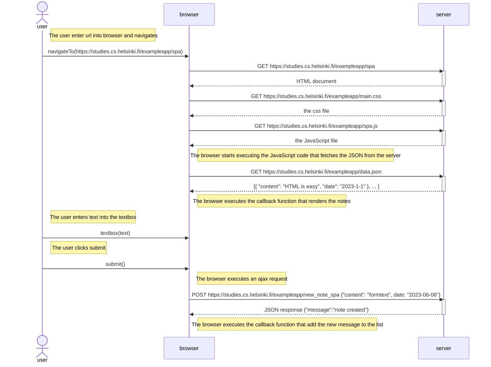

```mermaid
sequenceDiagram
    actor user
    participant browser
    participant server

    Note right of user: The user enter url into browser and navigates
    user->>browser: navigateTo(https://studies.cs.helsinki.fi/exampleapp/spa)
    browser->>server: GET https://studies.cs.helsinki.fi/exampleapp/spa
    activate server
    server-->>browser: HTML document
    deactivate server

    browser->>server: GET https://studies.cs.helsinki.fi/exampleapp/main.css
    activate server
    server-->>browser: the css file
    deactivate server

    browser->>server: GET https://studies.cs.helsinki.fi/exampleapp/spa.js
    activate server
    server-->>browser: the JavaScript file
    deactivate server

    Note right of browser: The browser starts executing the JavaScript code that fetches the JSON from the server

    browser->>server: GET https://studies.cs.helsinki.fi/exampleapp/data.json
    activate server
    server-->>browser: [{ "content": "HTML is easy", "date": "2023-1-1" }, ... ]
    deactivate server

    Note right of browser: The browser executes the callback function that renders the notes

    Note right of user: The user enters text into the textbox
    user->>browser: textbox(text)

    Note right of user: The user clicks submit
    user->>browser: submit()

    Note right of browser: The browser executes an ajax request
    browser->>server: POST https://studies.cs.helsinki.fi/exampleapp/new_note_spa {"content": "formtext", date: "2023-06-06"}
    activate server
    server-->>browser: JSON response {"message":"note created"}
    deactivate server

    Note right of browser: The browser executes the callback function that add the new message to the list
```
